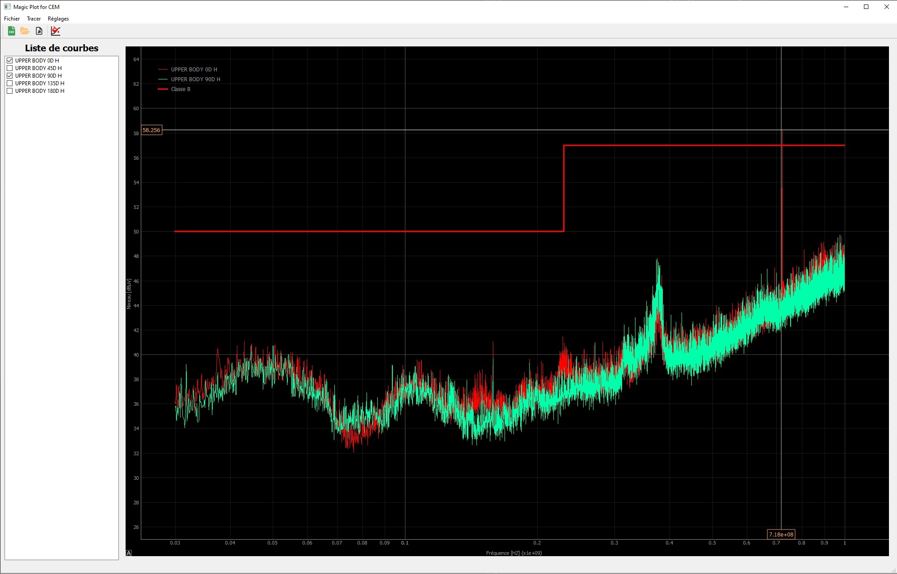

# Magicplot for CEM

Magicplot for CEM est une interface graphique en Python utilisant le Framework PyQt5.

Le but de ce programme est de pouvoir traiter rapidement et facilement les mesures faites à l'aide de l'analyseur de spectre.

## Avancement du projet

### Opérationel

- Interface opérationelle
- Ouverture de 1 ou plusieurs fichiers
- Plot de 1 ou plusieurs courbes
- Crosshair et coordonnées fonctionnels
- Plot le max de X courbes (Comparaison de valeur pour chaque fréquence donnée)
- Sauvegarde dans un fichier CSV de ces valeurs max
- Renomage des fichiers en .csv (Pour les fichiers venant de l'analyseur)
- Traitement du CSV (Suppressions des informations inutiles, ajout de header)

### En cours de dev

#### Important pour RC
- Plaçage d'un marqueur via le curseur de la souris (clique aux coordonées)

#### Bonus
- Ajout de configuration référence (Courbe de référence pour chaque modèle de robot)
- Permettre de connaitre l'angle à laquelle a été prise une mesure
- Plot un graphique en 3D (Fréquence, Niveau, Angle) pour le max

### Installation

**Prérequis**
Il faut avoir Python 3.6 minimum d'installé.

**Installation manuelle**
Magic Plot peut s'installer manuellement. Il suffit de télécharger le repo [ici](https://gitlab.aldebaran.lan/int-mecatro/magicplot/-/archive/beta/magicplot-beta.zip).

1. **Linux**
   - Unzip l'archive dans le dossier de votre choix
   - Ouvrir un terminal
                            
            sudo python3 setup.py install
   - Une fois installé, dans le terminal taper

            magicplot
   - Magic Plot se lance

2. **Windows**
   - Unzip l'archive dans le dossier de votre choix
   - Ouvrir un terminal
                            
            sudo python3 setup.py install
   - Une fois installé, sur le bureau, créer un nouveau fichier de type text et renomer le *magicplot.bat*
   - Faite un clique droit/Modifier.
  
            @echo off
            "C:\Program Files\Python3x\python.exe" "C:\Users\"Votre sessions windows"\AppData\Roaming\Python\Python3x\site-packages\MagicPlot\magicplot.py"
            pause

        x correspond à la version de votre python, si vous êtes en Python 3.6 alors il faut remplacer x par 6
    
   - Enregistrer votre fichier
   - Double cliquer sur magicplot.bat et Magic Plot doit se lancer. 

**Installation via pip**

Magic Plot est disponible sur le serveur PyPi local de SBRE.

1. **Linux**
   - Ouvrir un terminal
  
            pip install magicplot==beta-1 --trusted-host jenkins-testprod --extra-index-url http://jenkins-testprod:8080/repository/pypi-sbre/simple
   - Une fois installé, dans le terminal taper

            magicplot
   - Magic Plot se lance

2. **Windows**
   - Ouvrir un terminal
  
            pip install magicplot==beta-1 --trusted-host jenkins-testprod --extra-index-url http://jenkins-testprod:8080/repository/pypi-sbre/simple
   - Une fois installé, sur le bureau, créer un nouveau fichier de type text et renomer le *magicplot.bat*
   - Faite un clique droit/Modifier.
  
            @echo off
            "C:\Program Files\Python3x\python.exe" "C:\Users\"Votre sessions windows"\AppData\Roaming\Python\Python3x\site-packages\MagicPlot\magicplot.py"
            pause

        x correspond à la version de votre python, si vous êtes en Python 3.6 alors il faut remplacer x par 6
    
   - Enregistrer votre fichier
   - Double cliquer sur magicplot.bat et Magic Plot doit se lancer.